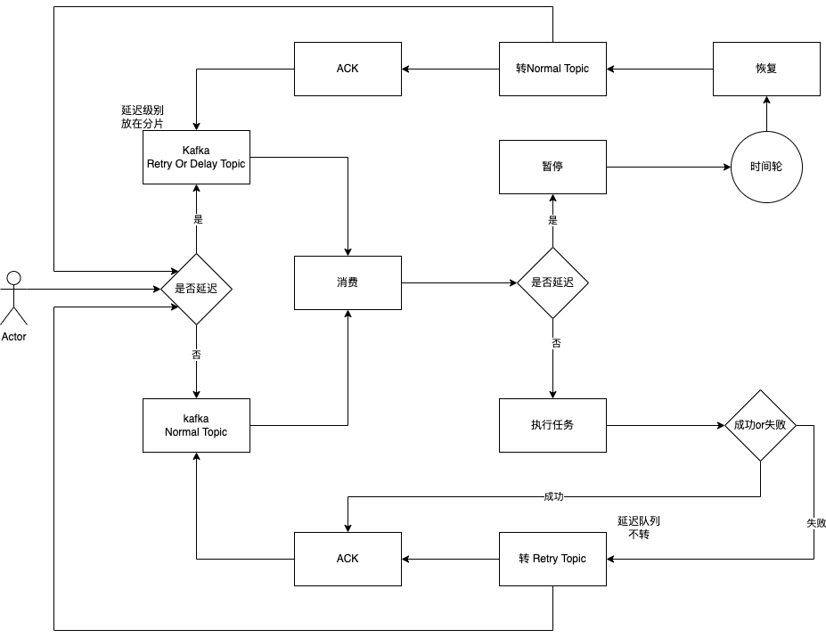

# kafka-delay

## 目标

1. kafka 支持延迟队列
2. Kafka 解决单分片并发时消息丢失问题

## 设计

1. 采用暂停消费者+时间轮的方式实现
2. 使用Redis Zset记录消息，并且定时提交最小的已ACK的消息
3. 关闭自动提交

## 模式

### Merge
Merge 延迟队列和重试队列使用同一个Topic，重试不区分分组（group.id）

需要新建主题:
topic_test, RETRY..DELAY..topic_test

### Separation
Separation 延迟队列和重试队列分开，重试队列区分分组

需要新建主题:
topic_test, RETRY..group_test..topic_test, RETRY..topic_test

### Independent
Independent 延迟队列和重试队列分开，重试队列区分分组, 所有延迟队列使用同一个

需要新建主题:
topic_test, RETRY..group_test..topic_test, RETRY..common
